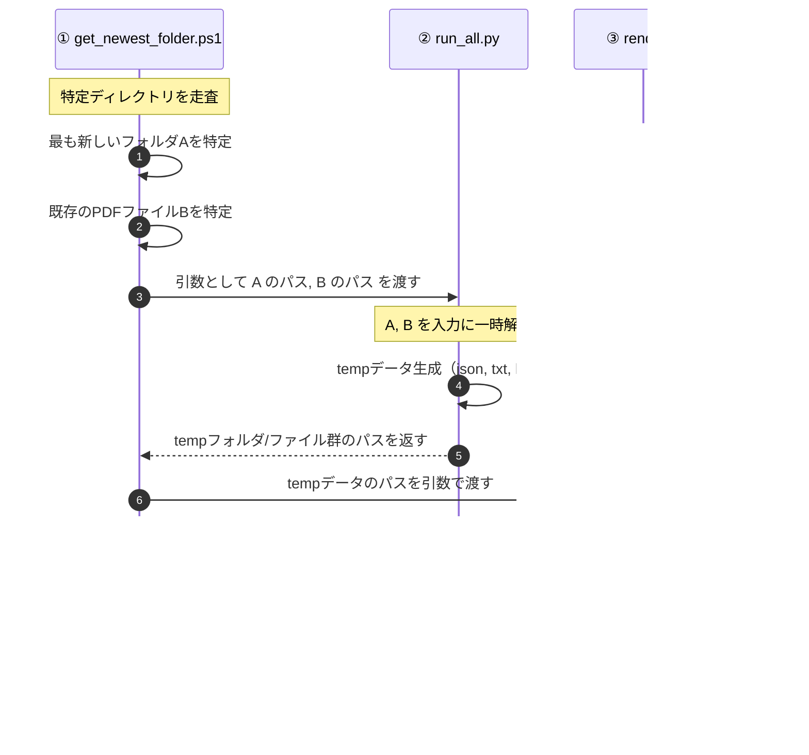

```mermaid

sequenceDiagram
    autonumber
    participant PS1 as ① get_newest_folder.ps1
    participant PY as ② run_all.py
    participant JS as ③ render.js

    Note over PS1: 特定ディレクトリを走査
    PS1->>PS1: 最も新しいフォルダAを特定
    PS1->>PS1: 既存のPDFファイルBを特定
    PS1->>PY: 引数として A のパス, B のパス を渡す

    Note over PY: A, B を入力に一時解析
    PY->>PY: tempデータ生成（json, txt, log など）
    PY-->>PS1: tempフォルダ/ファイル群のパスを返す

    PS1->>JS: tempデータのパスを引数で渡す

    Note over JS: tempデータをHTMLに流し込み
    JS->>JS: PuppeteerでPDFレンダリング
    JS-->>PS1: 出力PDFのパス（完成品）
```
